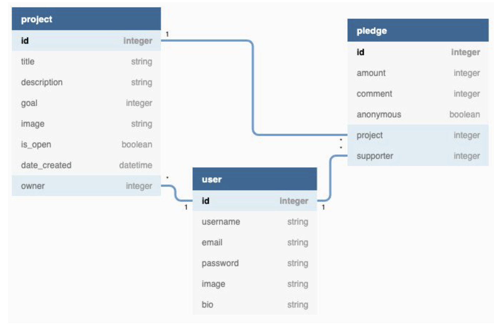
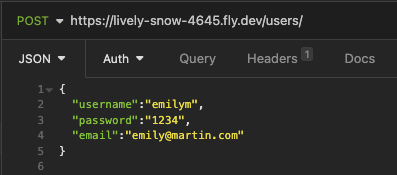
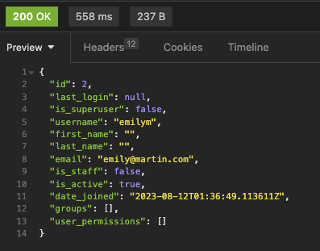
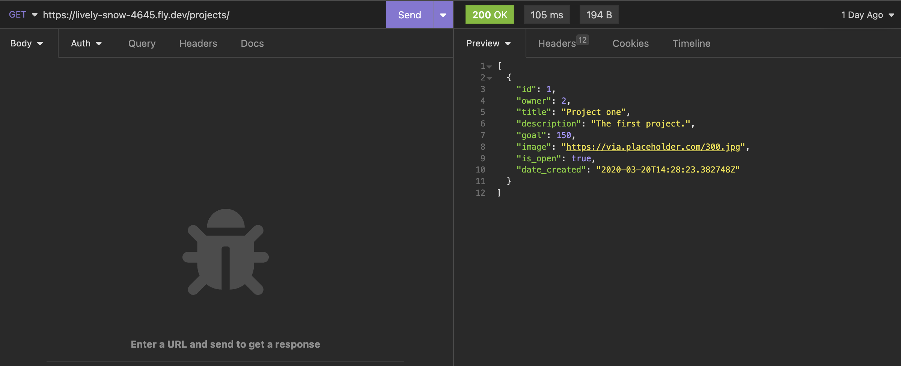
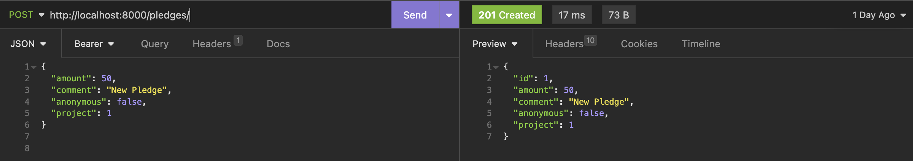
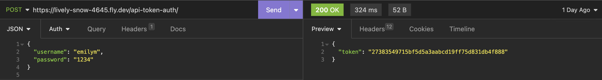

# 
 She-Codes-DRF 

# 
 LendAHand   

  By Emiy Martin.
   She Codes crowdfunding project - DRF Backend.

## About My Project:
The purpose of this website is to create a crowdfunding platform focused on providing support to people with disabilities. The target audience is individuals who are passionate about making a positive impact in the lives of people with disabilities by offering their time / resources or financial contributions.

## Features:
- Create User
    * Users able to update their own profile / account information.
- Login / Logout functions
- Users can create projects to offer help / services (e.g., cleaning, grocery shopping, lawn mowing).
    * Project can be updated by owner.
    * Date / time when project is created.
- Users can create pledges to seek financial assistance.
    * Pledge supporter can update the pledge.
    * Date / time when pledge is created.
    * Pledges created with or without comments / bio

### Stretch Goals:
- A live tally of how many people we have helped, including how much money has raised.
- A rate and review system to "boost" certain projects and/ or pledges.
- Users able to close or create an end-date to their project. 
- A feature that includes a "for every 1$, I will donate X$".
- Integration of a messaging system to allow direct communication between users (this will be impossible for me).

## API Specification:

| HTTP Method | Url | Purpose | Request Body | Successful Response Code | Authentication   Authorization
| --- | ------- | ------ | ---- | -----| ----|
| GET | users/ | Return all users | N/A | 200 | N/A |
| GET | projects/ | Return all projects | N/A | 200 | N/A |
| GET | pledges/ | Return all pledges | N/A | 200 | N/A |
| POST | projects/ | Create a new project | project object | 201 | Bearer token. User must be logged in. |
| POST | pledges/ | Create a new pledge | pledge object | 201 | Bearer token. User must be logged in. |
| POST | users/ | Create a new user | user object | 201 | N/A |
| POST | api-token-auth/ | Recieve Bearer Token to be Authorized | usename, password and email | 200 | N/A |
| PUT | project/ | Updated project | project object | 201 | Bearer token. User must be logged in. Owner of the project. |
| PUT | pledge/ | Updated pledge | pledge object | 201 | Bearer token. User must be logged in. Owner of the pledge. |
| DELETE | project/ | Delete project | N/A | 204 | Bearer token. User must be logged in. Owner of the project. |
| DELETE | pledge/ | Delete pledge | N/A | 204 | Bearer token. User must be logged in. Owner of the pledge. |

## Database Schema:

## Wireframes
{{ Insert your wireframes }}

## Colour Scheme:

## Fonts:

## Submission Documentation

Deployed Project: [Deployed website](https://lively-snow-4645.fly.dev/projects/)

### How To Run
What steps to take to run this code:

- Naviagte to the directory you want to store the project.
- Run the command: git clone https://github.com/emart55/She-Codes-DRF1.git
- Create & activate your Virtual Environment:
    * Navigate into your project directory - Run the command:
         <u>cd She_Codes-DRF1</u>

    * For Mac - Run the command: 
         <u>source venv/bin/activate</u>

    * Install Djano Library - Run the command:
         <u>python -m pip install -r requirements.txt</u>

    * Run Database Migrations:
         <u>python manage.py migrate</u>

     * Run Your Server:
         <u>python manage.py runserver</u>

- You should be using the URL http://127.0.0.1:8000/
    * Open your API tool (Insomnia) and use the API Specifications which will allow you to create your HTTP requests.

### Updated Wireframes

### How To Register a New User

 Please note: These instructions are based on the API tool Insomnia:
* Create a new HTTP Request:
  Open your Insomnia application and create a HTTP request by clicking the "New Request". 

* Choose HTTP Method:
  Select the HTTP method you will be using for registering a new user - This will be a 'POST' request.

* Request URL or endpoint:
  Registration endpoint - https://lively-snow-4645.fly.dev/users/.

* Change Body Text Type:
  Ensure in this instance you change the body text type to 'JSON'.

* Add Request Body:
  The fields required for registering a new user - 
    1. Username, 
    2. Password, 
    3. Email, 

  JSON request body example: 

 

* Send Request:
  Click the 'Send' button, displayed next to your endpoint URL.

* Sent Response:
  The successful request will return the 200 response and the user - Example below:

 

* Your New User is registered.

### Screenshots
* A screenshot of Insomnia, demonstrating a successful GET method for any endpoint.

* A screenshot of Insomnia, demonstrating a successful POST method for any endpoint.

* A screenshot of Insomnia, demonstrating a token being returned.

